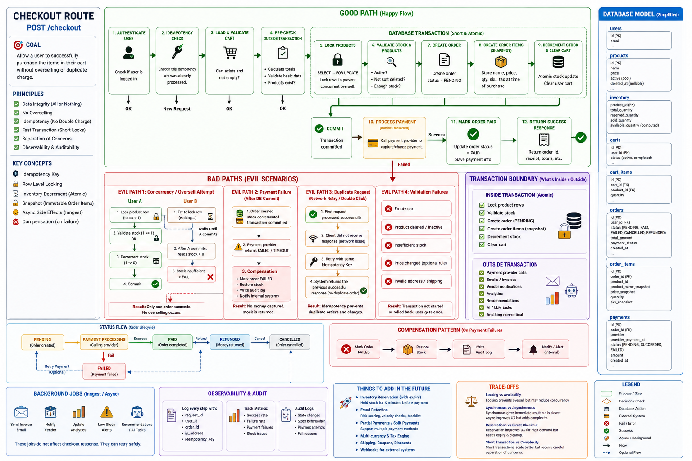

# Playground

A full-stack engineering **learning and systems design lab** built to move beyond “tutorial coding” and into **real-world backend thinking, architecture decisions, and deep tool understanding**.

This repository is my personal **engineering arsenal** — a place where I intentionally break down systems, rebuild them, and document how production-style backend systems actually work.

It is not a final product.

It is a **reference system for future me** — how to design APIs, scale services, integrate AI, and think like a senior engineer.

---

## 🎯 Why I built this project

I created this repository after going through **three technical interviews that I failed**.

In all of them, I was able to code and build features — but I realized something important:

> I was coding on “autopilot mode”, not thinking deeply about the systems I was building.

In one interview, a senior engineer asked me questions like:
- What is the difference between **GraphQL and REST**?
- Is the **DOM part of the backend or frontend?**
- Why would you choose one architecture over another?

I could answer, but not with deep clarity or real-world reasoning.

That was the turning point.

So I built this project to:
- Stop relying on “framework knowledge”
- Deep dive into **how tools actually work**
- Understand **why architectural decisions are made**
- Learn how to think in terms of **business + scalability**, not just code

---

## 🧠 Core Philosophy

> Tools come and go. Engineering thinking stays.

This repo is structured around that idea:
- Not just “how to use NestJS or FastAPI”
- But **why you design systems in a certain way**
- And what trade-offs exist in real-world backend systems

---

## 📁 Repository Structure

| Path | Purpose |
|------|--------|
| `backend/` | NestJS production-style API (GraphQL, REST, WebSockets, AI, Prisma) |
| `client/` | Next.js full-stack frontend with real-time and AI UX |
| `LangGraph/` | Python agents, RAG systems, and graph-based LLM workflows |
| `playground-fastapi/` | 🚀 Advanced backend systems (PDF pipeline, checkout, idempotency, background jobs) |

---

# ⚙️ Backend (NestJS)

A full-featured backend built to explore **real production backend patterns**.

## Key features
- REST + GraphQL APIs
- WebSockets (Socket.IO chat system)
- JWT authentication (refresh + logout flow)
- Prisma + PostgreSQL data modeling
- AI integrations (OpenAI, Gemini, Vercel AI SDK)
- Sentry monitoring + logging
- Modular architecture (feature-based design)

## Real-time systems
- Chat system with rooms, messages, and read receipts
- Socket gateway using `/chat` namespace
- GraphQL subscriptions for real-time updates

## AI Layer
- Tool-based AI agents (Zod structured tools)
- Gemini + OpenAI unified usage patterns
- File analysis + code execution endpoints
- Bot + caching experiments

---

# 🚀 FastAPI (MOST IMPORTANT PART)

This folder represents my **deep dive into backend engineering beyond frameworks**.

I intentionally built this to understand:
- Scalability under load (10k+ users)
- File processing pipelines
- Idempotent systems
- Background job architecture
- CPU vs I/O trade-offs

---

## 🧩 Why FastAPI exists in this repo

After my interview failures, I realized I was missing **system-level thinking**.

So I built FastAPI as a **separate backend laboratory** to simulate real production challenges:

> “How would a real system handle file uploads, payments, and heavy processing at scale?”

---

## 🔥 Core systems inside FastAPI

### 📄 1. PDF Processing Pipeline

A multi-step production-style pipeline:

- File upload validation
- Virus scanning (ClamAV integration)
- PDF/A validation
- Chunked reading for memory safety
- Structured extraction using LLMs
- Async processing pipeline

👉 Designed to simulate real document processing systems used in SaaS products.

---

### 💳 2. Checkout System (Business-grade design)

A fully designed **idempotent checkout flow**:

- Prevents duplicate payments using **idempotency keys**
- Handles retry-safe network requests
- Ensures “exactly-once” business execution
- Designed for real-world payment systems

👉 This is where I learned how backend systems protect business logic.

My code before 

```py
def create_order(
    self,
    user_id,
    request: OrderCreate
):
    """
        Simple Route
    """

    # Check user with his carts 
    # then save the order in the database
    # return the order successfully :)
```

to this 



---

### ⚙️ 3. Background Job System (Inngest)

To avoid blocking API requests:

- Heavy tasks moved to background workers
- PDF processing executed asynchronously
- API responds immediately (non-blocking design)

👉 This taught me real-world scaling patterns.

---

### 🧵 4. Concurrency Model

I explored:
- Async I/O vs CPU-bound operations
- Thread pools for blocking tasks
- Event loop behavior in FastAPI

👉 This helped me understand *why systems slow down*, not just how to code them.

---

## 📚 Documentation Philosophy

Every folder contains **my own written notes**, not copied tutorials.

Examples:
- concurrency models explained
- thread pool vs async breakdown
- FastAPI vs NestJS comparisons
- backend design reasoning

👉 These docs are the most important part of this repo for me.

---

# 🎨 Frontend (Next.js)

A modern frontend exploring:
- React 19 + App Router
- TanStack Query / Form / Table / Virtual
- Real-time chat UI
- WebSocket + GraphQL integration
- AI-powered UX experiments

Includes:
- Chat system UI
- 10k user performance demo
- Realtime AI chat interface
- Hook-level learning pages (useState, useEffect, useRef)

---

# 🧠 LangGraph (AI Agents Lab)

A structured exploration of:
- LangGraph state machines
- Tool-based LLM agents (ReAct pattern)
- Memory-based agents
- RAG pipelines with embeddings + vector DB
- Document assistants with tool calling

This folder helped me understand:
> how LLMs actually behave beyond API calls

---

# 📌 What this project represents

This repository is:

- Not a tutorial project
- Not a copy-paste boilerplate
- Not a finished product

It is a:
> **systems thinking training ground for backend engineering**

---

# 🚀 What I learned from building it

- How real backend systems scale
- Why architecture decisions matter more than syntax
- How to separate business logic from framework logic
- How to design idempotent and fault-tolerant systems
- How to think beyond “coding features”

---

# 📈 Future direction

I will continue using this repo as:
- My **engineering reference system**
- My **architecture playground**
- My **senior-level learning lab**

---

# 🧭 Final note

This project exists because I stopped coding on autopilot.

And started asking:

> “Why does this system exist this way?”

That question changed everything.