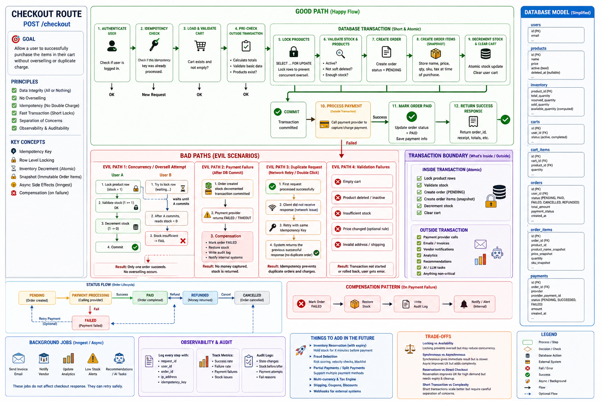

Every single route in checkout has it own file. because If I wrote function in one single file. It will exceed 1000 line it's okay but for readability 


```py
def create_order(
    self,
    user_id,
    request: OrderCreate
):
    """
        Simple Route
    """

    # Check user with his carts 
    # then save the order in the database
    # return the order successfully :)
```

the steps that I'm follow 



I created this image with ChatGPT after I disccussed with him the desgin or the steps that big comapnies do in there route. and I focused on the Evil path "errors". and I tried as much as possible to do. 

But no I don't do that. recently I trying to focus more in each route. in multiple parts
tradeoffs, evil path طريق الشيطان :"D, transactions. what is acceptable to fail and what is not acceptable to fail 


```
POST /checkout
        ↓
DB transaction
        ↓
Order = PENDING
        ↓
COMMIT
        ↓
Create PaymentIntent on server
        ↓
save payment_intent_id
        ↓
return client_secret
        ↓
Frontend
        ↓
Stripe.js confirmPayment(...)
        ↓
Stripe processes payment
        ↓
Stripe webhook
        ↓
Your backend verifies event
        ↓
Order = CONFIRMED / FAILED
```

```
1. Fix flash-sale compensation
   ├─ restore remaining_quantity
   └─ mark FlashSalePurchase appropriately

2. Define FlashSalePurchase state transitions
   PROCESSING
   COMPLETED
   FAILED

3. Decide coupon + flash-sale stacking rules
   and perform final calculation in checkout

4. Decide whether Order is:
   PENDING_PAYMENT
   rather than immediately treating it as a completed purchase

5. Change simulated _process_payment()
   → server-side Stripe PaymentIntent creation

6. Add Stripe webhook handling
   → payment_intent.succeeded
   → payment_intent.payment_failed
   → other relevant states

7. Eventually move background dispatch to a real outbox
   if you want durable event delivery
```