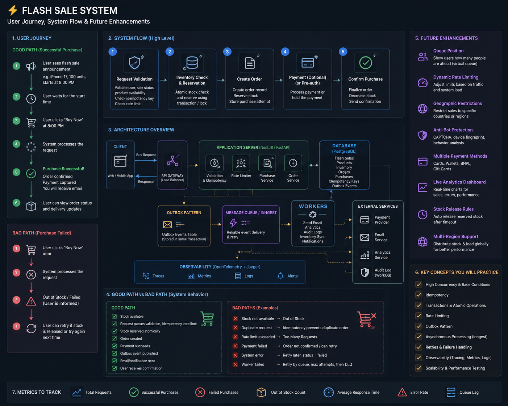

# Flash Sale / Limited Inventory Engine



```
PostgreSQL transactions
row locking
isolation levels
optimistic vs pessimistic concurrency
atomic updates
idempotency 
rate limiting
Inngest
Caching 
distributed systems
OpenTelemetry
metrics
```


## Tasks 

1. Model the flash-sale domain 
2. Build the minimal purchase endpoint
3. Make inventory concurrency-safe
4. Test the race condition
5. Add idempotency 
6. Add rate limiting 
7. Introduce asynchronous processing
8. Add outbox + events
9. Add retries / failure recovery 
10. Add real-time purchase status
11. Add OpenTelemetry + metrics 
12. Load-test the entire system


## Model 

```
                FLASH SALE
                    │
                    ▼
              PURCHASE REQUEST
                    │
          ┌─────────┴─────────┐
          │                   │
          ▼                   ▼
      Idempotency         Rate Limit
          │                   │
          └─────────┬─────────┘
                    ▼
              Inventory
                    │
              ┌─────┴─────┐
              │           │
            SUCCESS      SOLD OUT
              │
              ▼
             Order
              │
              ▼
            Events
              │
              ▼
           Workers
              │
       ┌──────┼──────┐
       ▼      ▼      ▼
     Audit  Email  Analytics
```


And surrounding all of it 

```
             OpenTelemetry
                  │
                  ▼
          traces + metrics
                  │
                  ▼
                Jaeger
```


## My Approach


Questions I want to answer 

1. Define a Flash sale
    - What fields I want to save it 
    - Can a product participate in multiple flash sales?
    - Can two flash sales for the same product run simultaneously?
    - What happens before `starts_at` and `ends_at`
    - Can admin cancel a sale? 
    - What happens if the product has 1000 normal stock units but the flash sale has only 100?

2. Define the purchase rules
    Good Request
        Sale is active -> Stock available -> User allowed -> Purchase succeeds
    Bad Request
        - Sale hasn't started
        - Sale has ended 
        - Sale is cancelled 
        - Product is sold out
        - User already purchased
        - User sends duplicate request 
        - User isn't authenticated

3. Define the inventory model

4. Define the minimum API


If I'm a product owner wants to make a flash sale for my product. so the important inputs that I need to have is product_id, starts_at, ends_at, percentage, for how many products

The important routes is 

1- route for the product owner to add flash sale for product
2- route for purchase 
3- I might need to have route to see how many customer paid for the product during the flash sale

I don't want the admin of the application to remove it. so only the product owner can do it

need to handle the requests because if we are in black friday and people wants to buy my product so I will get 1000 of requests. flash sale for product is only for 10 people so I Need to handle that 10 can get it and others get the sale is gone or show them caution that sale is no longer for the product 

so if we have a page. 100 people clicked purchase during the flash sale 10 people will get the sale and others will get caution or an out of stock. but it already in the stock but without sale need to pay for full price 

and flash sale it only for one product. but I can make it for all products. example Udemy do flash sale everyday for there courses 20%, 30% etc. but for the ecommerce need for one product. but it depends 

no product can participate in two flash sale it only in one. 

that besides the authentication no one outside of our application can get the product. need to handle the duplicate purchase using "idempotency", race condition 


Task 1:

1. A flash sale belongs to one product
2. It has a start/end time
3. It has a discount
4. It has a limited number of flash sale units
5. One customer can win once
6. A customer who already won can buy the product again, but at the normal price
7. Multiple users can attempt to buy simultaneously 
8. Exactly N customers can win, even under massive concurrency
9. Authentication + authorization determine who can create/manage the sale
10. Idempotency protects against duplicate requests 


```
                    FlashSale row
                         │
                    🔒 LOCK
                         │
          ┌──────────────┼──────────────┐
          │              │              │
       Request A      Request B      Request C
          │              │              │
        execute          wait           wait
          │
        commit
          │
       unlock
                         │
                      Request B
                       execute
                         │
                       commit
```

---

## Next Task


### Retries + failure states 

```
POST /flash-sales/123/purchase
        ↓
validate user
        ↓
reserve flash-sale unit
        ↓
decrement product stock
        ↓
create purchase
        ↓
 call payment provider
        ↓
payment fails / timeout / network error
```

So the problem now 

```
Flash sale unit -= 1
Product Stock -= 1
Purchase created = YES
Payment = UNKNOWN
```

Need to create route `GET /flash-sales/{flash_sale_id}/purchases/{purchase_id}`

Frontend can poll. to check the status of the payment 


The Statuses that we need for payment is "COMPLETED", "PROCESSING", "FAILED"
and if the payment fail we need to recover the product +1 and the status payment to be failed 
and we might send the user an email to his email address telling him that payment failed. he needs to check that out

if the payment timeout or something wrong happen so we can let the user can report us and we can investigate because the payment gateway has logs for what happens in our application if there is someone paid. and in chapter 8 in DDIA. this problem it's in all distributed system 

```
                    FLASH SALE
                        │
          ┌─────────────┼──────────────┐
          │             │              │
          ▼             ▼              ▼
    Transactions    Race conditions  Idempotency
          │             │              │
          └─────────────┼──────────────┘
                        │
                        ▼
                  Payment Provider
                        │
                        ▼
                Network failure
                        │
                        ▼
                 UNKNOWN STATE
                        │
                        ▼
                 Retry / Recovery
```